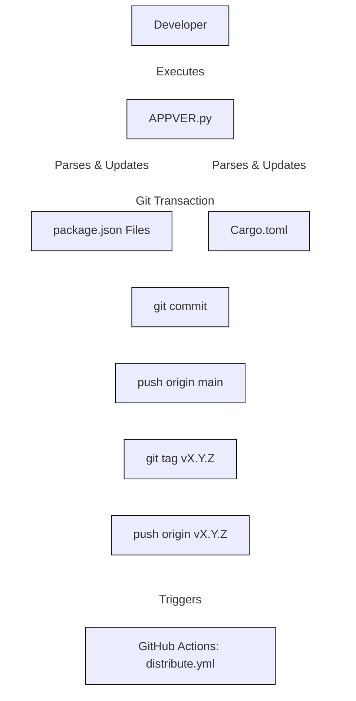

# Release Strategy and Version Control Architecture

## 1\. Philosophy and Standards

The **SpatialShot** ecosystem adheres to a strict **Synchronized Monorepo Versioning** strategy. Although the repository contains heterogeneous components—Rust middleware, C++ capture engines, and TypeScript interfaces—all subsystems share a unified version identifier. This ensures strict interoperability guarantees between the Orchestrator, the CaptureKit, and the frontend Presentation Layer.

The project adheres to **Semantic Versioning 2.0.0** (SemVer). Version increments are strictly mapped to the following schema:

* **Major (X.y.z):** Incompatible API changes or fundamental architectural shifts in the Orchestrator/IPC protocol.
* **Minor (x.Y.z):** New features added in a backward-compatible manner.
* **Patch (x.y.Z):** Backward-compatible bug fixes and performance optimizations.

-----

## 2\. The Single Source of Truth: [CHANGELOG.md](../CHANGELOG.md)

The `CHANGELOG.md` file serves a dual purpose within the architecture:

1. **User Documentation:** It follows the [Keep a Changelog](https://keepachangelog.com/en/1.0.0/) standard to provide human-readable audit trails of changes.
2. **Decentralized API:** It acts as a serverless "latest version" endpoint. The Electron client parses this file directly to determine update availability, eliminating the need for a dedicated version-check server.

**Format Specification:**
The automated parser relies on specific Markdown headers to extract semantic version strings.

```markdown
## [Version] - Date
```

The regular expression engine utilizes `^##\s+v?(\d+\.\d+\.\d+)` to identify the most recent release entry.

-----

## 3\. Monorepo Synchronization (APPVER Utility)

To mitigate version drift across the polyglot codebase, manual version editing is prohibited. The **`APPVER.py`** utility acts as the centralized control plane for release management.

### 3.1 Target Manifests

The utility performs atomic write operations on the following dependency manifests to ensure they are strictly synchronized before a release tag is generated:

| Component | Technology | Manifest File | Format |
| :--- | :--- | :--- | :--- |
| **Core** | React/TypeScript | `packages/core/package.json` | JSON |
| **Container** | Electron | `packages/spatialshot/package.json` | JSON |
| **CaptureKit** | C++/Qt | `packages/capturekit/package.json` | JSON |
| **Orchestrator** | Rust | `packages/orchestrator/Cargo.toml` | TOML |

### 3.2 Automation Sequence

Executing `python scripts/APPVER.py <version>` triggers the following sequence:

1. **Manifest Parsing:** The script identifies the file type (JSON vs TOML) and creates an abstract syntax tree representation of the configuration.
2. **Version Injection:** The new version string is injected into the identified paths, replacing the previous value while preserving file formatting and comments.
3. **Git Transaction:**
      * Stages all modified manifests (`git add`).
      * Commits with a standardized chore message: `chore: bump version to X.Y.Z`.
      * Pushes the `main` branch upstream.
      * Generates a lightweight Git Tag: `vX.Y.Z`.
      * Pushes the Tag to `origin`, which triggers the **Distribution CI Pipeline** (`distribute.yml`).



-----

## 4\. Client-Side Update Heuristics

SpatialShot implements a "self-healing" update mechanism. The application does not download update binaries directly; instead, it delegates the update process to the resident **Bootstrap Installer**.

### 4.1 Detection Logic

The update check routine executes asynchronously within the Electron main process:

1. **Fetch:** The client performs an HTTP GET request to the raw GitHub user content URL for `CHANGELOG.md`.
2. **Cache Busting:** A timestamp query parameter (`?t={now}`) is appended to the URL to bypass edge caching and ensure retrieval of the latest commit.
3. **Comparison:** The regex-extracted remote version is compared against `app.getVersion()` using a semantic segmentation algorithm (splitting strings by delimiter `.`).
4. **Prompt:** If `Remote > Local`, a native OS dialog prompts the user to update.

### 4.2 The Bootstrap Loop

Upon user confirmation, the application does not attempt to overwrite itself. Instead, it leverages the **Installer Architecture**:

1. **Locator:** The application resolves the path to the permanent installer binary (`spatialshot-installer`) located in the parallel `../spatialshot-installer/` directory.
2. **Execution:**
    * **Windows/macOS:** Uses the `open` command to launch the installer GUI.
    * **Linux:** Iterates through a prioritized list of terminal emulators (`gnome-terminal`, `konsole`, `xterm`, etc.) to spawn the installer in a detached process context.
3. **Termination:** The application issues `app.quit()`, releasing file locks and allowing the installer to overwrite the application binaries.

### 4.3 Installer Behavior during Update

Because the installers are configured to pull artifacts from the `latest` release endpoint (as defined in `installers.md`), launching the local installer effectively performs a force-update. The installer:

1. Downloads the artifacts associated with the tag triggered by `APPVER.py`.
2. Overwrites the contents of `~/.local/share/spatialshot` (or equivalent).
3. Relaunches the updated application.
